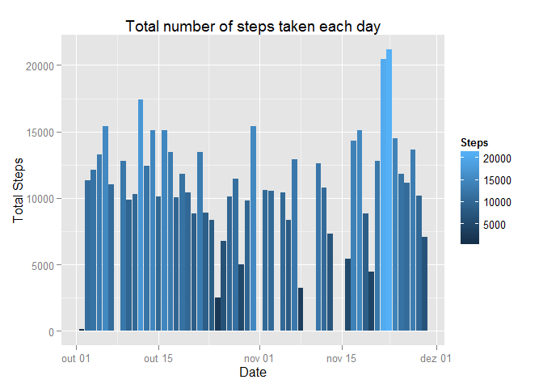
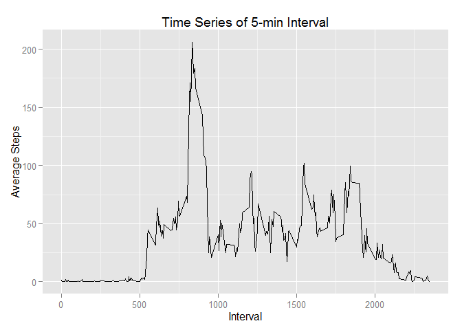
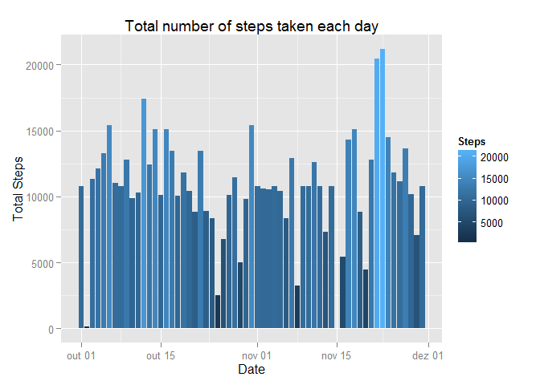
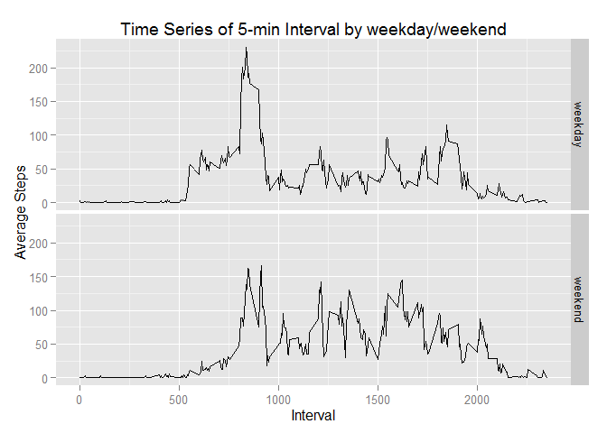

# Reproducible Research: Peer Assessment 1


```
## 
## Attaching package: 'dplyr'
## 
## The following object is masked from 'package:stats':
## 
##     filter
## 
## The following objects are masked from 'package:base':
## 
##     intersect, setdiff, setequal, union
```


## Loading and preprocessing the data

```r
    ##1. Load the data
    activityData <- read.csv(unz("./repdata-data-activity.zip", "activity.csv"))

    ##Convert to date
    activityData$date <- as.Date(activityData$date)
```

## What is mean total number of steps taken per day?

```r
    notNAsteps <- complete.cases(activityData$steps)
    
    ##1. Calculate the total number of steps taken per day
    TotalByDay <- group_by(activityData[notNAsteps,], date)
    TotalByDay <- summarize(TotalByDay, totalSteps = sum(steps))

    ##2. Make a histogram of the total number of steps taken each day
    histPlot <- ggplot(TotalByDay, aes(date, totalSteps))
    histPlot <- histPlot + geom_histogram(stat = "identity", aes(fill = totalSteps))
    histPlot <- histPlot + labs(title = "Total number of steps taken each day",
                                x = "Date", y = "Total Steps",
                                fill = "Steps")
    histPlot
```

 

```r
    ##3. Calculate and report the mean and median of the total number of steps 
    ##   taken per day
    mean(TotalByDay$totalSteps)
```

```
## [1] 10766.19
```

```r
    median(TotalByDay$totalSteps)
```

```
## [1] 10765
```

## What is the average daily activity pattern?

```r
    AvgByInterval <- group_by(activityData[notNAsteps,], interval)
    AvgByInterval <- summarize(AvgByInterval, avgSteps = mean(steps))

    ##1. Make a time series plot (i.e. type = "l") of the 5-minute interval 
    ##   (x-axis) and the average number of steps taken, averaged across all days (y-axis)
    timeSeriesPlot <- ggplot(AvgByInterval, aes(interval, avgSteps)) + geom_line()
    timeSeriesPlot <- timeSeriesPlot + labs(title = "Time Series of 5-min Interval",
                                            x = "Interval", y = "Average Steps")
    timeSeriesPlot
```

 

```r
    ##2. Which 5-minute interval, on average across all the days in the dataset, 
    ##   contains the maximum number of steps?
    AvgByInterval[order(AvgByInterval$avgSteps, decreasing = TRUE), ][1,]
```

```
## Source: local data frame [1 x 2]
## 
##   interval avgSteps
## 1      835 206.1698
```

## Imputing missing values

```r
    completeData <- merge(activityData, AvgByInterval, by.x = "interval", by.y="interval", all=TRUE)

    ##1. Calculate and report the total number of missing values in the dataset 
    ##   (i.e. the total number of rows with NAs)
    NAsteps <- is.na(completeData$steps)
    nrow(completeData[NAsteps, ])
```

```
## [1] 2304
```

```r
    ##2. Fill missing values
    completeData[NAsteps, ]$steps <- completeData[NAsteps, ]$avgSteps
    
    ##3. Create a new dataset that is equal to the original dataset but with the 
    ##   missing data filled in.
    completeData <- subset( completeData, select = -c(avgSteps) )
    
    ##4. Make a histogram of the total number of steps taken each day
    ##Summarize
    TotalByDay <- group_by(completeData, date)
    TotalByDay <- summarize(TotalByDay, totalSteps = sum(steps))

    histPlot <- ggplot(TotalByDay, aes(date, totalSteps))
    histPlot <- histPlot + geom_histogram(stat = "identity", aes(fill = totalSteps))
    histPlot <- histPlot + labs(title = "Total number of steps taken each day",
                                x = "Date", y = "Total Steps",
                                fill = "Steps")
    histPlot
```

 

```r
    ##4. Calculate and report the mean and median total number of steps taken 
    ##   per day
    mean(TotalByDay$totalSteps)
```

```
## [1] 10766.19
```

```r
    median(TotalByDay$totalSteps)
```

```
## [1] 10766.19
```

## Are there differences in activity patterns between weekdays and weekends?

```r
    ##1. Factor Weekend/Weekday
    completeData$wDay <- as.factor(ifelse(wday(completeData$date) %in% c(1, 7), 
                                          "weekend", "weekday"))
    
    ##2. Make a panel plot containing a time series plot
    AvgByInterval <- group_by(completeData, wDay, interval)
    AvgByInterval <- summarize(AvgByInterval, avgSteps = mean(steps))
    
    ##1. Make a time series plot (i.e. type = "l") of the 5-minute interval 
    ##   (x-axis) and the average number of steps taken, averaged across all days (y-axis)
    timeSeriesPlot <- ggplot(AvgByInterval, aes(interval, avgSteps)) + geom_line()
    timeSeriesPlot <- timeSeriesPlot + facet_grid(wDay ~ .)
    timeSeriesPlot <- timeSeriesPlot + labs(title = "Time Series of 5-min Interval by weekday/weekend",
                                            x = "Interval", y = "Average Steps")
    timeSeriesPlot
```

 

